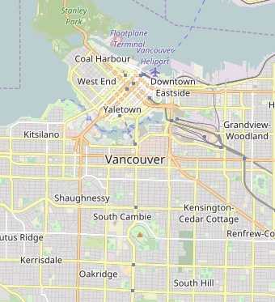

# Wrangling Vancouver's OpenStreetMap

[OpenStreetMap](https://www.openstreetmap.org/#map=12/49.2576/-123.1241) is an open sourced map of the world. In this project, I extracted a portion of OpenStreetMap, more specifically the city of Vancouver in Canada, as an xml file and audited for issues in the data and cleaned it up using Python.  I also transformed the data to a JSON format and imported it to a NoSQL MongoDB database for analysis.

## Files

| File name | Description |
| :--- | :--- |
| [auditing_keys.py](auditing_keys.py) | Python code to audit keys of all node and way elements |
| [auditing_phone.py](auditing_phone.py) | Python code to audit phone numbers of all node and way elements |
| [auditing_postcodes.py](auditing_postcodes.py) | Python code to audit postal codes of all node and way elements |
| [auditing_street_names.py](auditing_street_names.py) | Python code to audit street names of all node and way elements |
| [convert_to_json.py](convert_to_json.py) | Python code to cleanup the keys, street names, phone numbers and postal codes, and simultaneously convert and import the data to a JSON file |
| [create_mongodb.py](create_mongodb.py) | Python code to create a local MongoDB database |
| [create_sample.py](create_sample.py) | Python code to create a small sample OSM xml dataset |
| [data_exploration.py](data_exploration.py) | Python code to explore the OSM xml data |
| [environment.yml](environment.yml) | Conda environment required to run this code |
| [map_details.txt](map_details.txt) | Provides the link and description of the OSM map position used in this project |
| [medium_sample.osm](medium_sample.osm) | 10% sample OSM dataset |
| [project_report.ipynb](project_report.ipynb) | A report summarizing and providing details about the project |
| [references.txt](references.txt) | All sources used to help complete this project |
| [small_sample.json](small_sample.json) | cleaned small sample dataset in JSON format for loading into Mongodb |
| [small_sample.osm](small_sample.osm) | 1% sample OSM dataset |
| [wrangling_keys.py](wrangling_keys.py) | Python code to cleanup keys of all node and way elements and test/ validate the code |
| [wrangling_phone.py](wrangling_phone.py) | Python code to cleanup phone numbers of all node and way elements and test/ validate the code |
| [wrangling_postcodes.py](wrangling_postcodes.py) | Python code to cleanup postal codes of all node and way elements and test/ validate the code |
| [wrangling_street_names.py](wrangling_street_names.py) | Python code to cleanup street names of all node and way elements and test/ validate the code |

## Setup

- You must have [Anaconda](https://www.continuum.io/downloads) installed to run this code.
- Create a conda environment using [environment.yml](environment.yml) YAML file. More help on this can be found [here](https://conda.io/docs/using/envs.html#use-environment-from-file).

## License

The contents of this repository are covered under the [MIT License](LICENSE).
